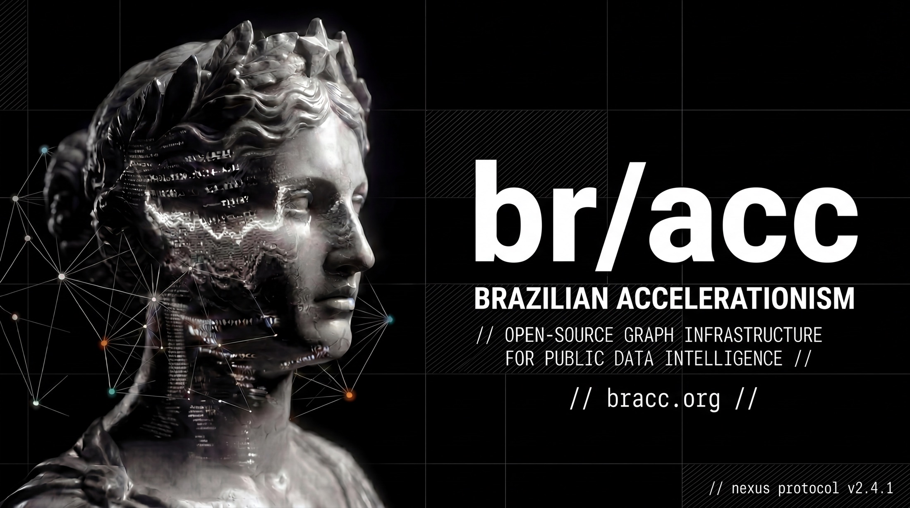

# BR/ACC Open Graph

[](docs/brand/bracc-header.jpg)

Language: **English** | [Português (Brasil)](docs/pt-BR/README.md)

[](https://github.com/World-Open-Graph/br-acc/actions/workflows/ci.yml)
[](https://www.gnu.org/licenses/agpl-3.0)

BR/ACC Open Graph is an open-source graph infrastructure for public data intelligence, built as an initiative from [World Open Graph](https://worldopengraph.com). Primary website: [bracc.org](https://bracc.org)

## What BR/ACC Represents

- Public-interest graph infrastructure for transparency work.
- Reproducible ingestion and processing for public records.
- Investigative signals with explicit methodological caution.

Data patterns from public records are signals, not legal proof.

## What Is In This Repository

- Public API (`api/`)
- ETL pipelines and downloaders (`etl/`, `scripts/`)
- Frontend explorer (`frontend/`)
- Infrastructure and schema bootstrap (`infra/`)
- Documentation, legal pack, and release gates (`docs/`, root policies)

## Architecture At A Glance

- Graph DB: Neo4j 5 Community
- Backend: FastAPI (Python 3.12+, async)
- Frontend: Vite + React 19 + TypeScript
- ETL: Python (pandas, httpx)
- Infra: Docker Compose

## Quick Start

```bash
cp .env.example .env
# set at least NEO4J_PASSWORD

make dev

export NEO4J_PASSWORD=your_password
make seed
```

- API: `http://localhost:8000/health`
- Frontend: `http://localhost:3000`
- Neo4j Browser: `http://localhost:7474`

## Repository Map

- `api/`: FastAPI app, routers, Cypher query loading
- `etl/`: pipeline definitions and ETL runtime
- `frontend/`: React application for graph exploration
- `infra/`: Neo4j initialization and compose-related infra
- `scripts/`: operational and validation scripts
- `docs/`: legal, release, and dataset documentation

## Operating Modes / Public-Safe Defaults

Use these defaults for public deployments:

- `PRODUCT_TIER=community`
- `PUBLIC_MODE=true`
- `PUBLIC_ALLOW_PERSON=false`
- `PUBLIC_ALLOW_ENTITY_LOOKUP=false`
- `PUBLIC_ALLOW_INVESTIGATIONS=false`
- `PATTERNS_ENABLED=false`
- `VITE_PUBLIC_MODE=true`
- `VITE_PATTERNS_ENABLED=false`

## Development

```bash
# dependencies
cd api && uv sync --dev
cd ../etl && uv sync --dev
cd ../frontend && npm install

# quality
make check
make neutrality

# Create development user
cd api && uv run create-dev-user --email admin@bracc.dev --password password123
```
### Docker Development

This application uses an external volume to persist Neo4j data. Before starting the services with Docker, you must create the volume manually:

```bash
docker volume create d71967adc2d23c9cce3b6c9e742d4b22c7bff9b78b26e6d5f9c2ce4abaf18051
```

Then, you can start the containers:

```bash
cd infra
docker-compose up -d
```

To create a development user inside the running container:

```bash
docker exec -it infra-api-1 create-dev-user --email admin@bracc.dev --password password123
```

> **Note on Permissions:** If you encounter `EACCES` errors with the `infra/neo4j/import` directory, run: `sudo chmod -R 777 infra/neo4j/import`. This ensures the directory is accessible across both host and container environments.

## API Surface

| Method | Route | Description |
|---|---|---|
| GET | `/health` | Health check |
| GET | `/api/v1/public/meta` | Aggregated metrics and source health |
| GET | `/api/v1/public/graph/company/{cnpj_or_id}` | Public company subgraph |
| GET | `/api/v1/public/patterns/company/{cnpj_or_id}` | Returns `503` while pattern engine is disabled |

## Contributing

Contributions are welcome. Start with [CONTRIBUTING.md](CONTRIBUTING.md) for workflow, quality gates, and review expectations.

## Contributors

- BRACC Core Team — maintainers
- OpenAI Codex — AI-assisted engineering contributor

## Legal & Ethics

- [ETHICS.md](ETHICS.md)
- [LGPD.md](LGPD.md)
- [PRIVACY.md](PRIVACY.md)
- [TERMS.md](TERMS.md)
- [DISCLAIMER.md](DISCLAIMER.md)
- [SECURITY.md](SECURITY.md)
- [ABUSE_RESPONSE.md](ABUSE_RESPONSE.md)
- [docs/legal/legal-index.md](docs/legal/legal-index.md)

## License

[GNU Affero General Public License v3.0](LICENSE)
