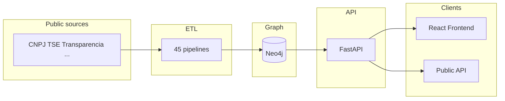

# Product Requirements Document — br/acc Open Graph

**Last updated: 2026-03-06**

This PRD documents the current product features and scope of the br/acc repository. Update the date above whenever this document is revised.

---

## 1. Vision and goals

- **Vision**: Open-source graph infrastructure that ingests and normalizes Brazilian public databases into a single queryable graph. The system does not interpret, score, or rank — it surfaces connections and lets users draw their own conclusions.
- **Goals**:
  - Local reproducibility via `bootstrap-demo` (deterministic seed) and `bootstrap-all` (full ingestion).
  - Public, safe API for programmatic access to graph data.
  - Frontend for search and exploration of corporate networks and entity connections.
  - LGPD-compliant, public-safe defaults and no personal data exposure in public deployments.

---

## 2. Users and personas

| Persona | Description |
|--------|-------------|
| **Developer / researcher** | Uses the API and/or frontend to query companies, contracts, sanctions, and connections. |
| **Contributor** | Adds or maintains ETL pipelines, documentation, and code. |
| **Operator** | Runs `bootstrap-all`, monitors source health, and checks reference metrics. |

---

## 3. Features by domain

| Domain | Features (summary) | References in repo |
|--------|--------------------|---------------------|
| **ETL / ingestion** | 45 implemented pipeline modules; registry per `source_id` (status, tier, category); `bootstrap-demo` (deterministic seed) and `bootstrap-all` (full ingestion); BYO-data workflow; audit output under `audit-results/bootstrap-all/`. | [source_registry_br_v1.csv](../source_registry_br_v1.csv), [data-sources.md](../data-sources.md), [bootstrap_all.md](../bootstrap_all.md), `etl/src/bracc_etl/pipelines/*.py` |
| **Graph (Neo4j)** | Normalized schema; entities (Company, Person, Contract, Sanction, etc.) and relationships; reference production metrics published. | [reference_metrics.md](../reference_metrics.md) |
| **API** | Health check; aggregated meta and source health; public subgraph by CNPJ; pattern analysis per company (when enabled); authenticated routes: entity, search, graph, investigations, patterns, baseline; matrix of public vs restricted endpoints. | [public_endpoint_matrix.md](../release/public_endpoint_matrix.md), `api/src/bracc/routers/*.py` |
| **Frontend** | Landing; Login/Register (when not in public mode); Dashboard; Search; Entity analysis (with graph); Patterns (feature flag); Baseline by entity; Investigations and shared investigation by token (when not in public mode). | [App.tsx](../../frontend/src/App.tsx), [AppShell.tsx](../../frontend/src/components/common/AppShell.tsx) |
| **Reproducibility** | `make bootstrap-demo`, `make bootstrap-all`, reports in `audit-results/`, public scope documentation. | [public_scope.md](../public_scope.md) |
| **Privacy and compliance** | Public-safe defaults (e.g. `PUBLIC_MODE`, `PUBLIC_ALLOW_PERSON`); exposure tiers (public_safe vs restricted); LGPD; legal and ethics docs. | [public_endpoint_matrix.md](../release/public_endpoint_matrix.md), root [README](../../README.md) (Legal & Ethics) |

---

## 4. Scope and boundaries

- **In scope**: API, frontend, ETL framework, Docker-based infra, demo dataset, compliance and governance docs.
- **Out of scope (by default)**: Pre-populated production Neo4j dump; private/institutional operational modules; guarantees on availability of third-party government portals.

---

## 5. Metrics and transparency

- Node and relationship counts are published in [reference_metrics.md](../reference_metrics.md) as a reference production snapshot (with `as_of_utc`).
- Source status is tracked in the registry: `loaded`, `partial`, `stale`, `blocked`, `not_built`.
- Pipeline status summary: [pipeline_status.md](../pipeline_status.md). CI and security gates: see [docs/ci/](../ci/) when relevant.

---

## 6. Cross-references

- [README](../../README.md) — project overview and quick start
- [CONTRIBUTING](../../CONTRIBUTING.md) — contribution guidelines
- [public_scope.md](../public_scope.md) — what is included in the public repo
- [data-sources.md](../data-sources.md) — data source catalog
- [pipeline_status.md](../pipeline_status.md) — pipeline status summary
- [bootstrap_all.md](../bootstrap_all.md) — full ingestion orchestration
- [Legal index](../legal/legal-index.md) — legal and ethics documents
- [Release policy](../release/release_policy.md) — release process

---

## High-level architecture

